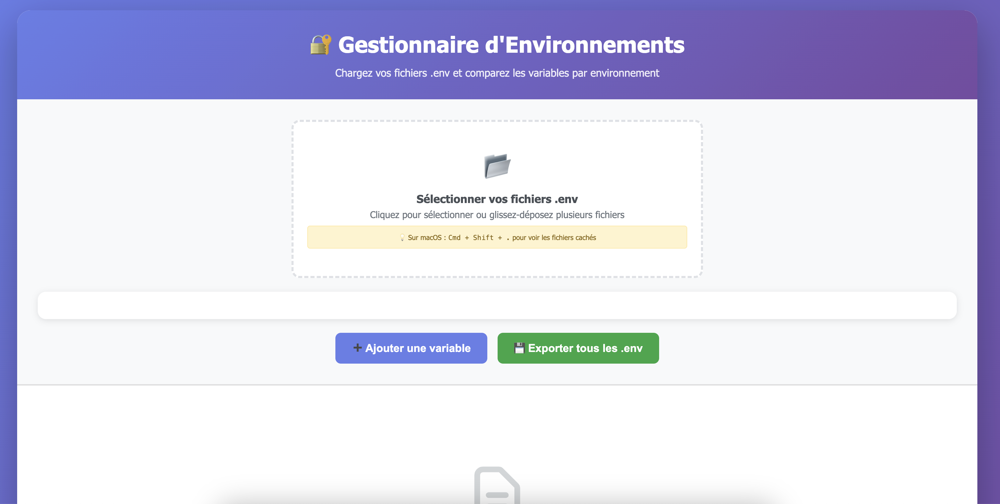

# 🔐 Environment Manager

A modern web application to compare and manage `.env` files across different environments (development, staging, production).
**[🔗 https://wassim6.github.io/envs-diff-gui/](https://wassim6.github.io/envs-diff-gui/)**

## 🌟 Features

- **Multiple Upload**: Load multiple `.env` files simultaneously
- **Automatic Detection**: Automatic environment detection based on filenames
- **Visual Comparison**: Comparison table with highlighted differences
- **Inline Editing**: Edit values directly in the interface
- **Individual Export**: Download each modified `.env` file
- **Environment Management**: Support for dev, qal, prd and other custom environments

## 🚀 Live Demo

Try the application online: **[🔗 https://wassim6.github.io/envs-diff-gui/](https://wassim6.github.io/envs-diff-gui/)**

> 💡 **Tip**: The application works entirely in your browser - no server required!

## 📖 Usage

1. **File Selection**:
   - Click on the upload area or drag-and-drop your `.env` files
   - Supports files named `.env.dev`, `.env.qal`, `.env.prd`, etc.

2. **Comparison**:
   - View all variables in a comparison table
   - Columns are colored according to the environment

3. **Editing**:
   - Edit values directly in the table
   - Add new variables with the "➕ Add Variable" button

4. **Export**:
   - Download updated `.env` files individually
   - Export all environments at once

## 💡 macOS Tips

On macOS, `.env` files are hidden by default. To view them:
- In the dialog box: Press `Cmd + Shift + .`
- Select multiple files at once

## 🛠️ Supported Environments

- `dev` - Development (green)
- `qal` - Quality Assurance (yellow)
- `prd` - Production (red)
- `staging` - Staging (blue)
- `test` - Test (purple)
- `production` - Alternative Production (pink)

## 📋 Prerequisites

- Modern web browser
- No server required - works entirely client-side

## 🔒 Security & Privacy

All operations take place in your browser. No files are sent to external servers.

- **100% Local Processing**: Your `.env` files never leave your machine
- **No Data Collection**: No tracking, analytics, or data storage
- **Complete Privacy**: Perfect for sensitive configuration files

---

*Application built with ❤️ using pure HTML/CSS/JavaScript*
